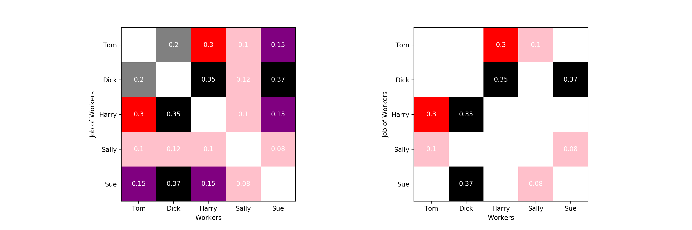

# Linear Assignment Problem
单一匹配

以工人与岗位为例, 一人一岗, 现对一个部门内的五个人进行岗位调整, 
要求每个人不能继续在原有岗位, 矩阵中的数值为工人对各个岗位的不满意程度, 目标则是在人员调动后满意度达到最高

+ Brute Force, 算法的时间复杂度为O(n!)
+ Hungarian, O(n^3)
+ Jonker volgenant, O(n^3) 比 Hungarian快
+ Random, O(n), 不能保证结果最优

在kaggle鲸尾匹配中中所用到的方法, 为把注意力集中在不匹配的且相似度高的样本上, 将lapjv搜索到的结果及对角线设为无穷大, 

